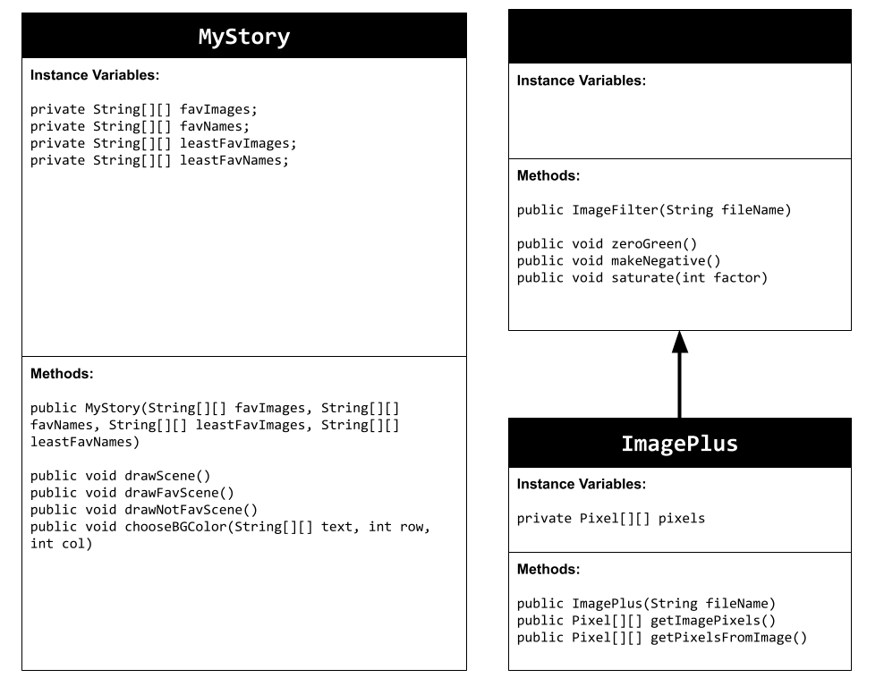
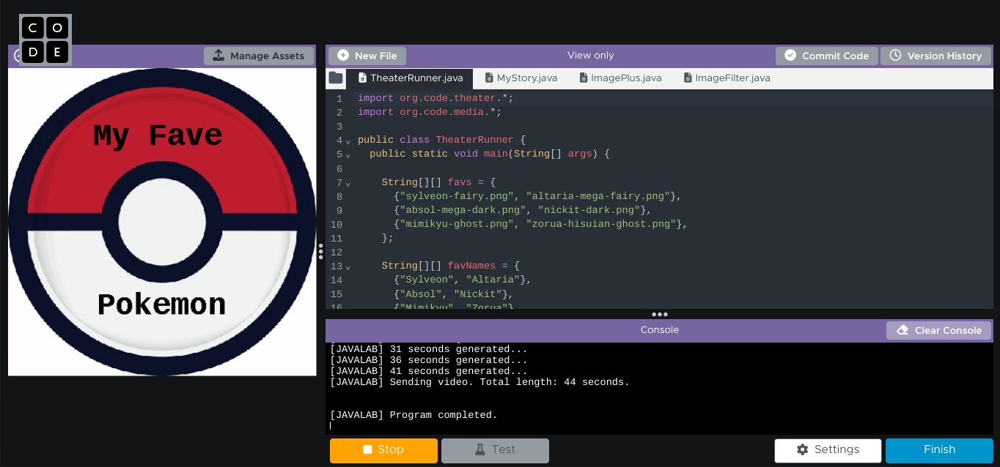

# Unit 4 - Personal Narrative

## Introduction

Images are often used to portray our personal experiences and interests. We also use image filters and effects to change or enhance the mood of an image. When combined into collages and presentations, these images tell a story about who we are and what is important to us. Your goal is to create a personal narrative using The Theater that consists of images of your personal experiences and/or interests, incorporates data related to these experiences and/or interests that can be organized in a 2D array, and uses image filters and effects to change or enhance the mood of your images.

## Requirements

Use your knowledge of object-oriented programming, two-dimensional (2D) arrays, and algorithms to create your personal narrative collage or animation:

- **Create at least two 2D arrays** – Create at least two 2D arrays to store the data that will make up your visualization.
- **Implement one or more algorithms** – Implement one or more algorithms that use loops and two-way or multi-selection statements with compound Boolean expressions to analyze the data.
- **Use Image Filters** - Include multiple image filters learned from this unit, and additionally create new ones of your own.
- **Use methods in the String class** – Use one or more methods in the String class in your program, such as to determine whether the name of an image file contains specific characters.
- **Create a visualization** – Create an image or animation that conveys the story of the data by illustrating the patterns or relationships in the data.
- **Document your code** – Use comments to explain the purpose of the methods and code segments and note any preconditions and postconditions.

## UML Diagram

## Video

## Story Description
My animation showcases both a list of some of my favorite Pokemon as well as my least favorite Pokemon. I use two different 2D arrays to store the images of my favorite and nonfavorite Pokemon. I also use 2D arrays to store the names of the Pokemon. These arrays allow me to display images and their names on the screen.
## Image Filter Analysis
A filter that I used in my project was the makeNegative() method. This method  inverts the colors in the image by setting the red,green, and blue color values of each Pixel object to the result of 255 minus their current values. Another filter I used was saturate() method. It takes an input of a certain value and uses it to create a new average in order to change the RGB values are displayed.